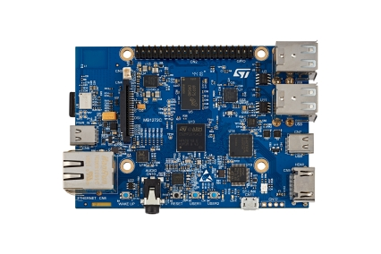
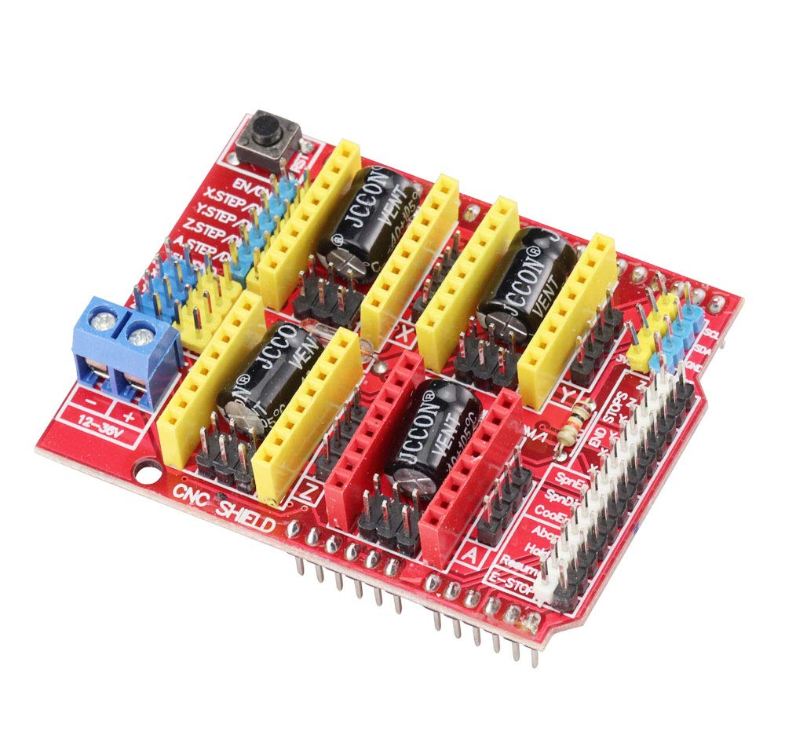

# Hardware

## STM32MP157D-DK1 development board.

To be able to use internal ADC, you will need to connect VREF+ to 3.3V. Either fit 0Ω resistor to R74, or connect IOREF (CN16, pin 2) to VREFP (CN13, pin 8).

This development board isn't fitted with Wi-Fi / Bluetooth module, so you will need ethernet cable. STM32MP157F-DK2 does have this module.

### Arduino connectors pinout

<table>
<thead>
  <tr>
    <th>Connector</th>
    <th>Pin name</th>
    <th>Signal name</th>
    <th>STM32 pin</th>
    <th>Comment</th>
  </tr>
</thead>
<tbody>
  <tr>
    <td rowspan="8">CN16</td>
    <td>1</td>
    <td>NC</td>
    <td>-</td>
    <td>NC</td>
  </tr>
  <tr>
    <td>2</td>
    <td>3V3</td>
    <td>-</td>
    <td>IOREF 3V3</td>
  </tr>
  <tr>
    <td>3</td>
    <td>NRST</td>
    <td>NRST</td>
    <td>NRST</td>
  </tr>
  <tr>
    <td>4</td>
    <td>3V3</td>
    <td>-</td>
    <td>3V3</td>
  </tr>
  <tr>
    <td>5</td>
    <td>5V</td>
    <td>-</td>
    <td>5V</td>
  </tr>
  <tr>
    <td>6</td>
    <td>GND</td>
    <td>-</td>
    <td>GND</td>
  </tr>
  <tr>
    <td>7</td>
    <td>GND</td>
    <td>-</td>
    <td>GND</td>
  </tr>
  <tr>
    <td>8</td>
    <td>VIN</td>
    <td></td>
    <td>Not connected</td>
  </tr>
  <tr>
    <td rowspan="6">CN17</td>
    <td>1</td>
    <td>A0</td>
    <td>PF14</td>
    <td>ADC2_IN6</td>
  </tr>
  <tr>
    <td>2</td>
    <td>A1</td>
    <td>PF13</td>
    <td>ADC2_IN2</td>
  </tr>
  <tr>
    <td>3</td>
    <td>A2</td>
    <td>ANA0</td>
    <td>ADC1_IN0, ADC2_IN0</td>
  </tr>
  <tr>
    <td>4</td>
    <td>A3</td>
    <td>ANA1</td>
    <td>ADC2_IN1, ADC1_IN1</td>
  </tr>
  <tr>
    <td>5</td>
    <td>A4</td>
    <td>PC3/PA12</td>
    <td>ADC1_IN13 (PC3)</td>
  </tr>
  <tr>
    <td>6</td>
    <td>A5</td>
    <td>PF12/PA11</td>
    <td>ADC1_IN6 (PF12)</td>
  </tr>
  <tr>
    <td rowspan="8">CN14</td>
    <td>1</td>
    <td>ARD_D0</td>
    <td>PE7</td>
    <td>USART7_RX</td>
  </tr>
  <tr>
    <td>2</td>
    <td>ARD_D1</td>
    <td>PE8</td>
    <td>USART7_TX</td>
  </tr>
  <tr>
    <td>3</td>
    <td>ARD_D2</td>
    <td>PE1</td>
    <td>IO</td>
  </tr>
  <tr>
    <td>4</td>
    <td>ARD_D3</td>
    <td>PD14</td>
    <td>TIM4_CH3</td>
  </tr>
  <tr>
    <td>5</td>
    <td>ARD_D4</td>
    <td>PE10</td>
    <td>IO</td>
  </tr>
  <tr>
    <td>6</td>
    <td>ARD_D5</td>
    <td>PD15</td>
    <td>TIM4_CH4</td>
  </tr>
  <tr>
    <td>7</td>
    <td>ARD_D6</td>
    <td>PE9</td>
    <td>TIM4_CH1</td>
  </tr>
  <tr>
    <td>8</td>
    <td>ARD_D7</td>
    <td>PD1</td>
    <td>IO</td>
  </tr>
  <tr>
    <td rowspan="10">CN13</td>
    <td>1</td>
    <td>ARD_D8</td>
    <td>PG3</td>
    <td>IO</td>
  </tr>
  <tr>
    <td>2</td>
    <td>ARD_D9</td>
    <td>PH6</td>
    <td>TIM12_CH1</td>
  </tr>
  <tr>
    <td>3</td>
    <td>ARD_D10</td>
    <td>PE11</td>
    <td>SPI4_NSS and TIM1_CH2</td>
  </tr>
  <tr>
    <td>4</td>
    <td>ARD_D11</td>
    <td>PE14</td>
    <td>SPI4_MOSI and TIM1_CH4</td>
  </tr>
  <tr>
    <td>5</td>
    <td>ARD_D12</td>
    <td>PE13</td>
    <td>SPI4_MISO</td>
  </tr>
  <tr>
    <td>6</td>
    <td>ARD_D13</td>
    <td>PE12</td>
    <td>SPI4_SCK</td>
  </tr>
  <tr>
    <td>7</td>
    <td>GND</td>
    <td>-</td>
    <td>GND</td>
  </tr>
  <tr>
    <td>8</td>
    <td>VREFP</td>
    <td>-</td>
    <td>VREF+</td>
  </tr>
  <tr>
    <td>9</td>
    <td>ARD_D14</td>
    <td>PA12</td>
    <td>I2C5_SDA</td>
  </tr>
  <tr>
    <td>10</td>
    <td>ARD_D15</td>
    <td>PA11</td>
    <td>I2C5_SCL</td>
  </tr>
</tbody>
</table>

## Arduino CNC shield

**WARNING : do not supply 3V3, 5V from Arduino shield**

